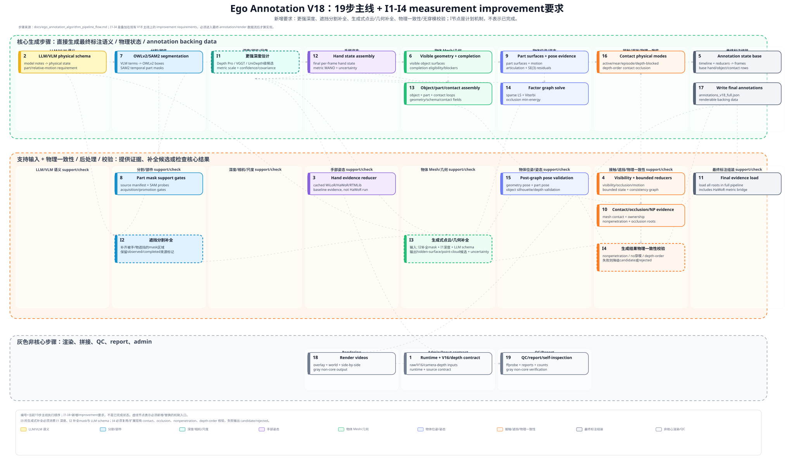

# Ego Annotation V18 核心生成与支持/校验流程图 + Improvement 要求

这张图使用 `docs/ego_annotation_algorithm_pipeline_flow.md` 中的 **19 个粗粒度步骤** 表示当前 V18 主线，并额外叠加 `I1`–`I4` 四个 planned measurement improvement requirements。`I` 节点是需要新增或替换的机制入口，不表示当前已经实现或通过验收；只有当这些机制实际驱动最终 annotation/render 数据流，并经过视频/几何 sanity check 后，才可算完成。

导图文件：[`ego_annotation_core_measurement_improvement_map.svg`](ego_annotation_core_measurement_improvement_map.svg)

## 编号规则

- `1`–`10`：measured/status evidence path 的粗粒度算法步骤，覆盖 runtime/input contract、LLM/VLM schema、hand reducer、visibility/bounded reducers、annotation state、visible geometry、segmentation、part/pose evidence、contact/occlusion/nonpenetration evidence。
- `11`–`17`：`scripts/run_v18_full_pipeline.py::build_case_annotations()` 的 final evidence load、hand/object/part/contact assembly、factor graph、post-graph validation、contact modes、final annotation write。
- `18`–`19`：`run_case()` 和 `run()` 的非核心 render、side-by-side compose、QC、report、self-inspection。
- `I1`–`I4`：本次新增的 improvement 要求层。它们不是当前代码执行顺序编号，而是必须接入现有 V18 主线的数据流约束。

## 新增 Improvement 要求

- `I1 更强深度估计`：用更强的深度/尺度估计算法替换或增强当前 V16/depth backbone，输出 metric depth、scale、confidence/covariance，并供 visible geometry、object/part assembly、factor graph 和物理校验消费。
- `I2 遮挡分割补全`：对 OWLv2/SAM2 等分割结果补齐被手、物体或遮挡关系隐藏的 mask 区域；补全部分必须保留 `observed` / `completed` 来源标记和不确定性，不能覆盖原始可见 mask 证据。
- `I3 生成式点云/几何补全`：对物体点云/visible surfaces 做生成式增强，补齐遮挡或不可见部分；输入至少包含 `I1` 深度、`I2` 补全分割、LLM/VLM physical schema，并输出 hidden-surface/point-cloud/mesh candidates 与 uncertainty。
- `I4 生成结果物理一致性校验`：所有 `I2`/`I3` 的新增生成结果进入最终 annotation 前，必须经过现有 contact、occlusion、nonpenetration、depth-order 风格的物理一致性校验；穿模、深度顺序冲突或非物理几何不能被提升为 solved state，只能降级为 candidate/rejected/unresolved。

## 关键边界

- `3` 是 `build_v18_hand_baseline_branch.py`，即 hand evidence reducer；它消费 cached WiLoR、HaWoR、RTMLib，不是现场执行 HaWoR。
- HaWoR metric MANO bridge 在 `11` 的 final evidence load 中由 `load_hawor_bridge_index()` 加载，并在 `12` 的 hand state assembly 中被消费。
- 灰色框不产生新的物理标注语义，只负责视频输出、拼接、帧数 QC、报告和 manifest/admin。
- `I` 节点必须改变最终可视化 annotation 或 backing data 的物理状态字段；只新增 JSON 字段、manifest、gate 或 report 不算实现。
- 编号代表代码执行顺序；空间代表功能分组；`I` 节点代表计划的机制接入点。

## 功能颜色

- 黄色：LLM/VLM 语义理解和 physical state schema。
- 蓝色：segmentation、part masks、part evidence，以及遮挡分割补全要求。
- 青色：depth/camera/scale backbone，以及更强深度估计要求。
- 紫色：hand pose / hand MANO support。
- 绿色：object mesh、visible/depth-fused geometry、part surfaces，以及生成式点云/几何补全要求。
- 靛色：object pose、part pose、articulation、factor graph。
- 橙色：contact、occlusion、nonpenetration、physical consistency，以及生成结果物理一致性校验要求。
- 深灰：final annotation assembly。
- 浅灰：render、compose、QC、report、manifest、audit；这些不是核心标注生成步骤。

## 连线规则

- 浅虚线表示关键跨功能依赖，例如 LLM schema 进入 segmentation/pose，part evidence 进入 object/part/contact assembly，hand/mesh/contact evidence 进入 factor graph 和 contact modes。
- `I1` 输出必须进入 geometry、assembly、factor graph 和物理一致性校验。
- `I2` 输出必须进入 part/object segmentation evidence 和 `I3` 生成式几何补全。
- `I3` 输出必须进入 object/part/contact assembly、factor graph、post-graph validation 和 `I4` 物理一致性校验。
- `I4` 输出必须决定生成结果能否进入 contact physical modes、pose validation 和 final annotations。
- 所有线条都在节点下层，避免遮挡编号、标题和脚本文本。
