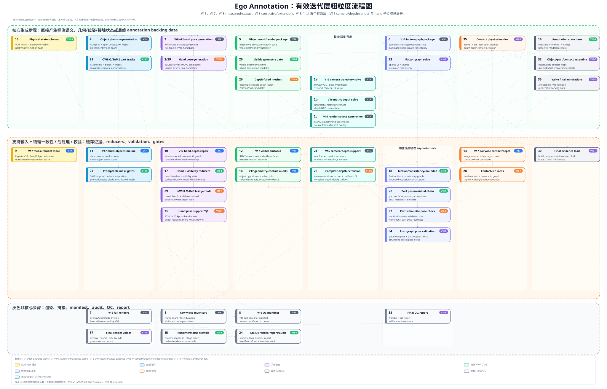

# Ego Annotation 有效迭代层粗粒度流程图

这张新图把当前 V18 final path 实际消费的有效迭代层完全展开，但仍保持现有图的结构：**上方是核心生成步骤**，**下方是支持输入、物理一致性、后处理和校验**，**灰色区域是非核心渲染/QC/admin**。

导图文件：[`ego_annotation_effective_iteration_pipeline_map.svg`](ego_annotation_effective_iteration_pipeline_map.svg)

## 有效层定义

当前 final path 没有消费 `V1`–`V15` 的历史探索，也没有消费 `V19` proposal。真正进入当前迭代的是以下 5 层：

| 层 | 步骤范围 | 步骤数 | 作用 |
|---|---:|---:|---|
| `V16` full package cache | `1`–`8` | 8 | full-duration V16 base：raw/frame contract、camera/depth、WiLoR hand base、object plan/segmentation、mesh-style render base、QC manifest |
| `V17` measurement/evidence cache | `9`–`14` | 6 | measurement store、hand-depth/interior graph、多物体 timeline/masks、visible surfaces/material motion、pairwise contact/depth、geometry/contact audits |
| `V18-S` measured/status evidence | `15`–`24` | 10 | runtime/status scaffold、physical schema、hand/visibility reducers、annotation state、visible geometry、OWLv2/SAM2 parts、part residuals、status renders/audits |
| `V18-X` corrective/extension roots | `25`–`29` | 5 | complete-depth/UniDepth extension、depth-fused meshes、part silhouette pose validation、contact/nonpenetration roots、HaWoR bridge/occlusion roots |
| `V18-F` final assembly/render | `30`–`38` | 9 | final evidence load、hand/object/part/contact assembly、factor graph、post-graph validation、contact modes、final JSON、renders、QC/report |

总计：`8 + 6 + 10 + 5 + 9 = 38` 个粗粒度步骤。

## 读图规则

- 编号按有效迭代层展开，而不是历史开发时间线里的所有 checkpoint。
- 节点右上角 badge 表示该步骤来自哪个有效层：`V16`、`V17`、`V18-S`、`V18-X`、`V18-F`。
- 颜色仍表示功能：LLM/VLM 语义、分割/部件、手部姿态、物体 mesh/几何、物体位姿/姿态、接触/遮挡、最终标注组装、非核心渲染/QC。
- 浅虚线表示关键跨层/跨功能依赖；浅实线表示同功能列内的局部数据流。

## 关键边界

- `3` 是 V16 delivered hand base，不等于 V18 的 hand reducer。
- `17` 是 V18 hand/visibility reducer，消费 cached WiLoR/HaWoR/RTMLib；它不是重新跑 raw-frame hand model。
- `29` 才是 V18 corrective/extension 层里的 HaWoR bridge/occlusion roots，供 final path 加载。
- `30` 是 `run_v18_full_pipeline.py::build_case_annotations()` 的 final evidence load；它把 V16/V17/V18-S/V18-X 的 roots 汇入内存。
- `37`–`38` 是灰色非核心步骤：它们渲染、拼接、检查和报告，不产生新的物理标注语义。
