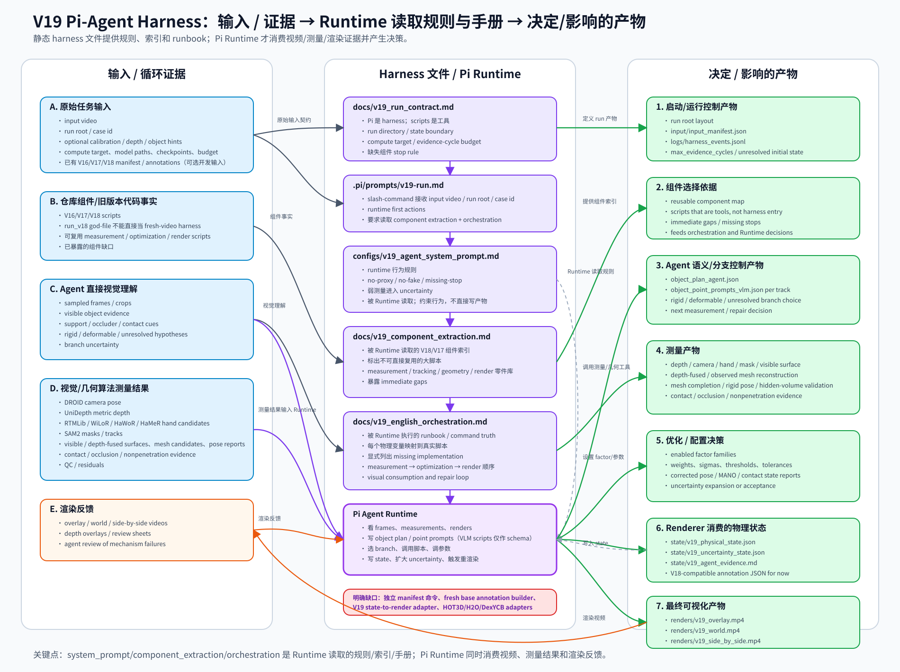

# V19 Harness 输入/输出结构

本文件记录当前仓库中 V19 Pi-agent harness 的运行逻辑。核对依据包括 `docs/v19_run_contract.md`、`.pi/prompts/v19-run.md`、`configs/v19_agent_system_prompt.md`、`docs/v19_component_extraction.md`、`docs/v19_english_orchestration.md` 以及当前存在的 V18/V19 脚本入口。结论是：这张图符合当前代码流程，但它描述的是 **Pi harness + runbook + 已有脚本工具** 的真实状态，不表示任意输入视频已经可以一键完整跑通。runbook 中声明缺失的组件仍然必须保留为缺失项。



## 符合性核对

- `docs/v19_run_contract.md` 明确写明 `Pi is the harness`，脚本只是可调用工具；本图把 run contract、prompt、component extraction、runbook 和 runtime 放在 harness 中间层，符合该设计。
- `.pi/prompts/v19-run.md` 是项目 slash-command 入口；本图把输入视频、run root、case id、预算、compute target 作为原始任务输入，符合入口参数和启动检查。
- `configs/v19_agent_system_prompt.md` 是规则层；它不直接写产物，而是约束 `Pi Agent Runtime` 不许 fake output、不许 proxy progress、必须保留 uncertainty。
- `docs/v19_component_extraction.md` 是组件索引/零件库；它说明 V18 哪些脚本可复用、哪些不是 fresh-video harness，本图已把它作为 runtime 必读的 harness 支撑文件。
- `docs/v19_english_orchestration.md` 明确要求 agent 写 `object_plan_agent.json` 和 per-track point prompt，替代旧 VLM API；本图把它们标为 agent 在循环中写出的中间控制产物，符合当前运行逻辑。
- DROID、UniDepth、RTMLib、WiLoR、HaWoR、SAM2、visible/depth-fused geometry、observed mesh reconstruction、rigid pose graph、hidden-volume validation、MANO interval、contact/occlusion/nonpenetration、render scripts 都是 runbook 中列出的真实脚本角色；本文已逐项覆盖 `docs/v19_english_orchestration.md` 中出现的脚本名，并且没有把不存在的一键 `run_v19_full_pipeline.py` 画成入口。
- 图中保留了缺失项：独立 raw-frame manifest 命令、fresh base annotation builder、V19 state-to-render adapter、benchmark adapters；这符合 runbook 的 “missing implementation, not to be faked” 规则。

## 中心节点的形象分工

严格说，中间是 **5 个 harness 文件 + 1 个 Pi Agent Runtime 运行体**：

- `docs/v19_run_contract.md`：像“项目章程/开工单”，规定怎么启动、run 目录长什么样、哪些东西必须写到 `state/` 和 `renders/`。
- `.pi/prompts/v19-run.md`：像“前台接单表”，接收 input video、run root、case id，并列出 run 开始前必须检查什么。
- `configs/v19_agent_system_prompt.md`：像“宪法/安全规则”，不直接产出文件，但约束 agent 不能假装完成、不能用 proxy 替代物理状态、必须保留 uncertainty。
- `docs/v19_component_extraction.md`：像“零件库/库存清单”，告诉 agent 哪些旧 V18/V17 脚本可以复用，哪些大脚本不能当 fresh-video harness，哪些组件还缺。
- `docs/v19_english_orchestration.md`：像“施工图/工艺路线”，说明每个物理变量该调用哪些真实脚本、哪些组件还缺、测量/优化/渲染按什么顺序走。
- `Pi Agent Runtime`：像“现场总工”，直接消费视频帧、agent 语义理解、算法测量结果和渲染反馈；它真正看证据、选择分支、调用脚本、决定是否调参数、写状态并要求重渲染。

`configs/v19_agent_system_prompt.md` 不应该有“直接写文件”的实线输出，因为它是规则层，不是产物生成器。它的输出是间接的：约束 `Pi Agent Runtime` 的行为，从而影响所有后续控制产物、参数决策、状态文件和渲染视频。

`Pi Agent Runtime` 必须接收 `D. 视觉/几何算法测量结果`。如果没有这条输入，它就只能按固定脚本顺序运行，无法根据 mask/depth/hand/pose/接触证据判断测量是否可信，也无法决定要修 prompt、换分支、调参数、重跑优化还是扩大 uncertainty。

## 按 runbook 的完整流程序列

```text
输入视频 / run root / case id
  -> Pi 用 run contract + slash prompt 启动
  -> 读取 system prompt、component extraction、English orchestration
  -> 建立时间线和坐标系
     - 当前可复用已有 V16/V17/V18 manifest
     - run_v16_full_pipeline.py 可在已有 annotations/WiLoR QC/depth 输入时再生 V16 manifest，但不是干净 fresh-video 第一步
     - 缺失：独立 input_video -> raw_frame_manifest/manifest.json 命令
  -> 跑 camera/depth/scale 测量
     - run_unidepth_full_frame_v3.py
     - run_unidepth_metric_source_v3.py
     - run_droid_full_frame.py
  -> 跑手部/MANO 测量
     - run_rtmlib_hand2d_v3.py
     - run_wilor_full_frame.py
     - export_hawor_world.py
     - run_hamer_rtmlib_hand_stream_v3.py
     - merge_hand_candidate_streams_v7.py
     - refit_mano_metric_depth_v3.py
  -> agent 看视频帧/证据，写物体计划和点提示
     - object_plan_agent.json
     - object_point_prompts_vlm.json per track
     - build_object_plan_vlm.py / build_object_point_prompts_vlm.py 只作为 schema 参考；V19 runtime 默认不调用 API
  -> SAM2 根据 agent points 跟踪物体 masks
     - run_sam2_vlm_points_multiobject.py
  -> mask + depth + camera 反投影/重建 object visible geometry
     - build_v19_visible_geometry_from_sam2_depth.py
     - build_v18_depth_fused_reconstruction.py（已有 V18 形状输入时的 depth-fused reconstruction 组件）
     - reconstruct_object_mesh_v2.py
     - reconstruct_scaled_observed_object_mesh_v3.py
     - reconstruct_object_visual_hull_depth_carve_v3.py
     - complete_object_heightfield_from_mask_depth_v3.py
  -> agent 基于证据选择 object branch
     - rigid / articulated / deformable / support-occluder / unresolved
  -> 如果 rigid，进入强制刚体分支
     - build_v18_compact_rigid_evidence_bundle.py
     - remote_run_trellis_shape_v3.py
     - build_v18_compact_rigid_trellis_completion.py
     - build_v18_scale_sane_compact_rigid_completion.py
     - fit_v18_compact_rigid_object_pose.py
     - solve_v19_rigid_object_pose_graph.py
     - build_v18_compact_rigid_hidden_volume_depth_validation.py
  -> MANO/object/contact/nonpenetration/occlusion 因子和区间修正
     - build_v18_mano_object_constraint_state.py
     - build_v18_full_bridge_mano_object_constraint_state.py
     - apply_v18_mano_object_constraint_state.py
     - solve_v18_joint_mano_interval_trajectory.py
     - build_v18_contact_ownership_graph.py
     - build_v18_occlusion_owner_graph.py
     - build_v18_signed_nonpenetration_evidence.py
     - build_v18_triangle_nonpenetration_evidence.py
  -> 可选通用 pose/hand/camera 优化组件（仅在 required inputs 存在时使用）
     - optimize_object_factor_graph_v3.py
     - optimize_joint_mano_object_graph_v3.py
     - optimize_joint_camera_object_graph_v3.py
     - optimize_contact_patch_object_pose_graph_v3.py
  -> 组装 renderer-consumed state
     - state/v19_physical_state.json
     - state/v19_uncertainty_state.json
     - state/v19_agent_evidence.md
     - 当前临时仍使用 V18-compatible annotation JSON 作为渲染 backbone
  -> 渲染全视频物理标注
     - render_v18_joint_mano_interval_correction.py
     - render_v18_compact_rigid_tomato_temporal_mano_attempt.py
     - render_v18_full_pipeline_from_annotations.py
  -> agent 消费 overlay/world/side-by-side render，定位机制失败并决定是否修复/重跑
  -> benchmark/ablation
     - 缺失：HOT3D/H2O/DexYCB adapters；没有 adapter 前不能声称外部定量评估
```

## 左右分列结构

```text
输入和循环证据                                  Harness 文件 / 运行体                              输出
────────────────                                  ─────────────────────                              ────
A. 原始任务输入                                  docs/v19_run_contract.md                            1. 启动/运行控制产物
├─ input video                      ───────────▶ ├─ 定义视频/run root/case contract ───────────────▶ ├─ run root 布局
├─ run root / case id               ───────────▶ ├─ 定义不可变 run 目录和 state 边界 ─────────────▶ ├─ input/input_manifest.json
├─ optional calibration/depth/hints ───────────▶ ├─ 定义 evidence-cycle 预算和 compute target ───▶ ├─ logs/harness_events.jsonl
└─ compute target/model/checkpoint/budget ─────▶ └─ 遇到缺失实现时停止并命名 blocker ───────────▶ └─ unresolved initial state files

A. 原始任务输入                                  .pi/prompts/v19-run.md                             1. 启动/运行控制产物
├─ input video                      ───────────▶ ├─ 接收 slash-command 参数 ──────────────────────▶ ├─ run-start checklist
├─ run root / case id               ───────────▶ ├─ 要求验证视频 metadata ───────────────────────▶ ├─ max_evidence_cycles declaration
└─ compute target/model/checkpoint/budget ─────▶ └─ 禁止 fake wrapper/scripts ───────────────────▶ └─ first unresolved physical blocker

Pi Agent Runtime 读取规则文件                    configs/v19_agent_system_prompt.md                 Pi Agent Runtime 行为约束
├─ runtime 启动上下文               ───────────▶ ├─ 定义 Pi 是 harness ─────────────────────────▶ ├─ no-proxy / no-fake 规则
├─ 用户任务和 runbook               ───────────▶ ├─ 强制物理状态和 uncertainty 语义 ───────────▶ ├─ 系统性错误必须修而不是调参掩盖
└─ 后续 A/C/D/E 证据由 Runtime 消费  ───────────▶ └─ 规定缺失组件必须 stop 并命名 blocker ────▶ └─ 输出声明必须由 render/state 支撑

Pi Agent Runtime 读取组件索引                    docs/v19_component_extraction.md                   2. 可复用组件索引 / 缺口清单
├─ 仓库已有 V16/V17/V18 scripts      ───────────▶ ├─ 区分 reusable components 和不可复用大脚本 ─▶ ├─ measurement/model-runner component list
├─ 旧 pipeline god-file              ───────────▶ ├─ 标出 fresh-video 不可直接复用的入口 ──────▶ ├─ rigid/contact/render 可复用路径
└─ 已知抽取缺口                      ───────────▶ └─ 为 orchestration 提供真实脚本地图 ───────▶ └─ immediate gaps exposed by extraction

Pi Agent Runtime 读取运行手册 + 证据              docs/v19_english_orchestration.md                  3. 测量/优化/渲染工艺路线
├─ A. 原始任务输入                  ───────────▶ ├─ 把物理变量映射到真实脚本 ─────────────────▶ ├─ camera/depth outputs
├─ C. agent 视觉理解                ───────────▶ ├─ 显式列出缺失实现 ─────────────────────────▶ ├─ hand candidate outputs
├─ D. 算法测量结果                  ───────────▶ ├─ 定义按机制修复的循环 ────────────────────▶ ├─ masks/tracks/visible surfaces
└─ E. 渲染反馈                      ───────────▶ └─ 排列 measurement → optimization → render ────▶ └─ contact/occlusion/nonpenetration evidence

C. Agent 直接视觉理解                             Pi Agent Runtime 写出的中间控制产物                4. Agent 语义/分支控制产物
├─ sampled frames/crops             ───────────▶ ├─ object_plan_agent.json ─────────────────────▶ ├─ SAM2 point-prompt inputs
├─ visible object evidence          ───────────▶ ├─ per-track object_point_prompts_vlm.json ────▶ ├─ SAM2 masks/tracks
├─ support/occluder/contact cues    ───────────▶ └─ rigid/deformable/unresolved branch proposal ─▶ └─ object branch selection
└─ branch uncertainty                ───────────▶

D. 算法测量结果                                  Pi Agent Runtime                                  5. 优化/配置决策
├─ masks/depth/hand/pose reports    ───────────▶ ├─ 判断测量可信度和系统性错误 ─────────────────▶ ├─ enabled factor families
├─ contact/occlusion/nonpenetration ───────────▶ ├─ 选择修 prompt、换分支、调参数或重跑优化 ───▶ ├─ weights/sigmas/thresholds/tolerances
└─ measurement QC / residuals       ───────────▶ └─ 决定扩大 uncertainty 还是接受状态 ─────────▶ └─ next measurement/repair decision

D. 算法测量结果                                  optimization scripts                               5. 优化/配置决策
├─ DROID camera pose                ───────────▶ ├─ solve_v19_rigid_object_pose_graph.py ───────▶ ├─ enabled factor families
├─ UniDepth metric depth            ───────────▶ ├─ solve_v18_joint_mano_interval_trajectory.py ▶ ├─ weights/sigmas/thresholds/tolerances
├─ RTMLib/WiLoR/HaWoR hand evidence ───────────▶ ├─ optimize_object/joint/contact graph scripts ─▶ ├─ corrected pose/MANO reports
├─ SAM2 masks/tracks                ───────────▶ ├─ V18/V19 contact/nonpenetration builders ───▶ ├─ hidden-volume/depth validation
├─ visible surfaces / mesh candidates ─────────▶ └─ 对可用 factor 做 robust objective ─────────▶ └─ residual/uncertainty summaries
└─ contact/occlusion evidence       ───────────▶

D. 算法测量结果                                  state assembly boundary                           6. Renderer 消费的物理状态
E. 渲染反馈                         ───────────▶ ├─ state/v19_physical_state.json ─────────────▶ ├─ physical state variables
                                                ├─ state/v19_uncertainty_state.json ───────────▶ ├─ uncertainty and unresolved blockers
                                                ├─ state/v19_agent_evidence.md ────────────────▶ ├─ evidence ledger
                                                └─ 当前临时使用 V18-compatible annotation JSON ─▶ └─ renderer-consumed annotation backbone

E. 渲染反馈                                      render scripts                                    7. 最终可视化产物
├─ overlay/world review videos       ◀────────── ├─ render_v18_joint_mano_interval_correction.py ▶ ├─ renders/v19_overlay.mp4
├─ review frames/depth overlays      ◀────────── ├─ render_v18_compact_rigid_tomato_temporal_mano_attempt.py
└─ agent visual sanity check         ◀────────── └─ render_v18_full_pipeline_from_annotations.py ▶ ├─ renders/v19_world.mp4
                                                                                                  └─ renders/v19_side_by_side.mp4
```

## 左侧树：Harness 输入和循环证据

```text
Harness 输入和循环证据
├─ A. 原始任务输入
│  ├─ input video
│  ├─ run root / case id
│  ├─ optional calibration / depth / known-object hints
│  ├─ compute target、model paths、checkpoints、budget
│  └─ 已有 V16/V17/V18 manifest 或 annotations（如果作为开发输入复用）
│
├─ B. 仓库组件/旧版本代码事实
│  ├─ V16/V17/V18 scripts
│  ├─ run_v18 god-file 不能直接当 fresh-video harness
│  ├─ 可复用 measurement / optimization / render scripts
│  └─ 已暴露的组件缺口
│
├─ C. Agent 直接视觉理解
│  ├─ sampled frames / crops
│  ├─ object_plan_agent.json
│  ├─ object point prompts
│  └─ rigid / deformable / unresolved、occlusion、contact hypotheses
│
├─ D. 视觉/几何算法测量结果
│  ├─ DROID camera
│  ├─ UniDepth depth
│  ├─ RTMLib / WiLoR / HaWoR / HaMeR hand candidates
│  ├─ SAM2 masks/tracks
│  ├─ visible surface / depth-fused mesh / mesh candidate / rigid pose reports
│  └─ contact / occlusion / nonpenetration evidence
│
└─ E. 渲染反馈
   ├─ overlay/world/side-by-side videos
   ├─ depth overlays / review sheets
   └─ agent review of mechanism failures
```

## 右侧树：Harness 输出

```text
Harness 输出
├─ 1. 启动/运行控制产物
│  ├─ run root 布局
│  ├─ input/input_manifest.json
│  ├─ logs/harness_events.jsonl
│  └─ max_evidence_cycles / unresolved initial state
│
├─ 2. 可复用组件索引 / 缺口清单
│  ├─ measurement/model-runner component list
│  ├─ rigid/contact/render reusable paths
│  └─ missing implementation stops
│
├─ 3. Agent 写出的语义/控制产物
│  ├─ object_plan_agent.json
│  ├─ object_point_prompts_vlm.json
│  ├─ rigid/deformable/unresolved branch choice
│  └─ evidence ledger / uncertainty notes
│
├─ 4. 测量产物
│  ├─ depth / camera / hand / mask / visible surface
│  ├─ mesh completion
│  ├─ pose reports
│  └─ contact / occlusion / nonpenetration evidence
│
├─ 5. 优化/配置决策
│  ├─ enabled factor families
│  ├─ weights、sigmas、thresholds、tolerances
│  └─ corrected pose/MANO/contact state reports
│
├─ 6. Renderer 消费的物理状态
│  ├─ state/v19_physical_state.json
│  ├─ state/v19_uncertainty_state.json
│  ├─ state/v19_agent_evidence.md
│  └─ V18-compatible annotation JSON while the V19 renderer adapter is missing
│
└─ 7. 最终可视化产物
   ├─ renders/v19_overlay.mp4
   ├─ renders/v19_world.mp4
   └─ renders/v19_side_by_side.mp4
```

## 说明

- Prompt、run contract、component extraction、orchestration markdown 是 harness 定义/运行依据，不是普通优化输入。
- `docs/pipeline_v19_design_proposal.md` 是设计背景和目标说明；它指导 harness 方向，但不是 `.pi/prompts/v19-run.md` 和 `configs/v19_agent_system_prompt.md` 要求 runtime 每次执行的核心 runbook 文件。
- `.memory/tasks/...` 是任务记忆/Workbench 状态；prompt 要求 runtime 读取它们，但它们不是当前仓库中固定的 harness 文件，也不替代 run contract 或 orchestration。
- `Agent 直接视觉理解` 是 harness loop 内产生的中间产物。第一轮可以来自 sampled video frames，后续轮次会继续消费 masks、depth overlays、geometry views 和 rendered review videos。
- `docs/ego_annotation_optimization_problem_view.md` 第 4 节参数对应图里的 `优化/配置决策`，不是 harness 的全部输出。
- 最终交付物是 renderer-consumed physical state 和可视化 annotation videos。参数选择只是内部控制量；只有当参数影响 state 或 rendered artifact 时，才需要作为证据被记录。
